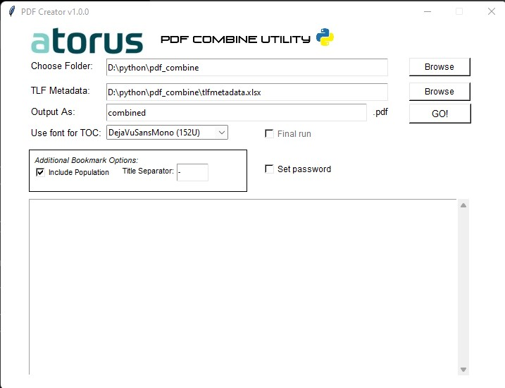

# PDF Combine Utility 
# 
# Introduction 
The Utility developed for convert TLF's files into *.pdf and combine then according to meta-data file. 

# Getting Started
 
1.	Download and run main.py
2.	Select target folder with all TLS's files stored. 
3.	Select metadta file. 
4.	Review and fix toc.txt files (if any issues). 

# Contribute
TODO: 

1. Add to usage OpenOfiice as convert tool.

DONE: 
1. Implemant "Final Run" check-dox logic: if False value - ignore errors origin from metadata files "*** fiels not found" - just add blank the page 
    to final pdf files with place holder like "ORIGINAL FIELS WAS NOT PROVIDED"

