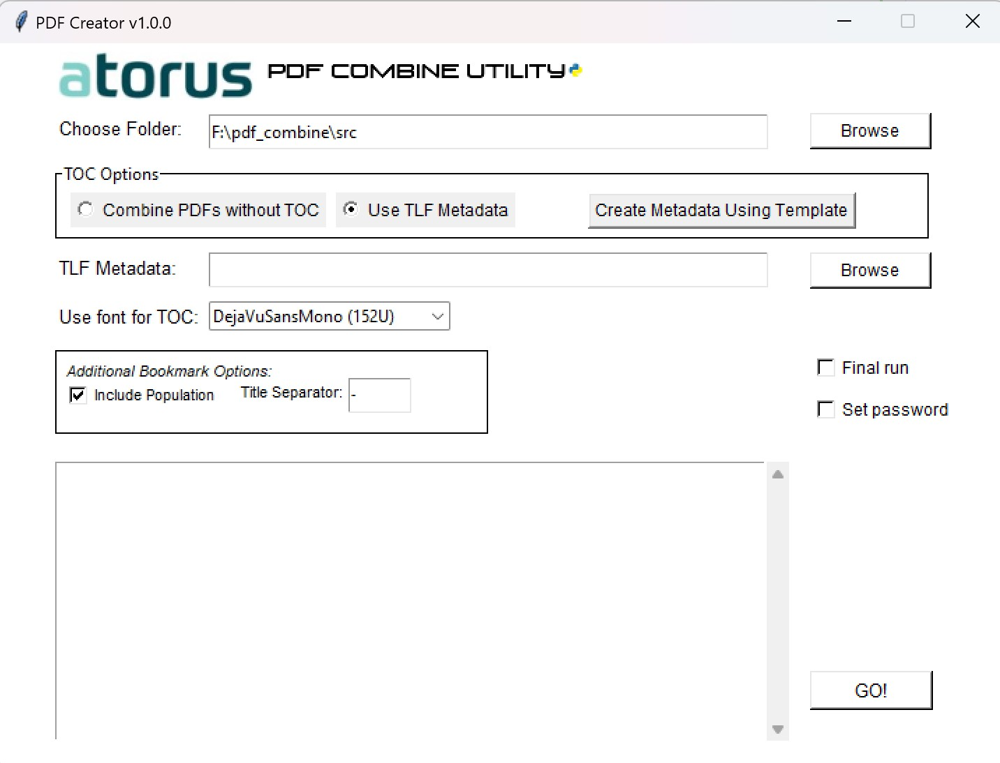

# PDF Combine Utility

A nice, simple and fast GUI application for combining RTF/PDF files with automated Table of Contents and bookmarks.

## Features

- Convert RTF files to PDF format
- Combine multiple PDF files with or without Table of Contents
- Generate automated bookmarks based on metadata
- Support for custom fonts in Table of Contents
- Password protection for output PDFs
- Support for large document sets
- Customizable bookmark formatting and separators (more to come!)
- Final run mode for production use with strict files match checking

## Installation

### Prerequisites

- Windows operating system
- Python 3.10 or higher
- Required Python packages (see `requirements.txt`)

### Installing Dependencies

```bash
pip install -r requirements.txt
```

### Building the Executable

To obtain the ".exe" file, you can download the latest release from the GitHub repository
or build it yourself using the provided build script.

To build yourself a standalone executable use a `build.py` script:

1. Ensure all required assets are present:
   - `assets/images/atorus_logo.png`
   - `assets/images/pdf_utility_logo.png`
   - `assets/images/python_logo.png`
   - `assets/images/pdf.ico`

2. Run the build script:
   ```bash
   python build.py
   ```

The script will:
- Verify all required assets exist
- Clean previous build directories
- Create a new executable using PyInstaller
- Package all necessary resources into the executable

Feel free to customize the build script to include additional assets or modify the build process.

## Usage


### Basic Operation
1. Launch the application
2. Select the working directory containing your RTF/PDF files
3. Choose one of two operating modes:
   - Simple combination without TOC
   - Full processing with TOC and bookmarks

### Operating Modes

#### Simple Combination
- Select source folder containing PDFs/RTFs
- Choose output filename
- Optionally set password protection
- Click "GO!" to combine files

#### Full Processing with TOC
1. Select source folder containing RTFs/PDFs
2. Provide metadata CSV file (use existing or create/save new using the template button)
3. Configure TOC options:
   - Select font for TOC
   - Set title separator
   - Choose bookmark options
4. Set output filename
5. Click "GO!" to process files

### Metadata File Format

The metadata CSV file should contain the following columns:
- `TLF`: Type of document (L/F)
- `Title3`: Main title
- `Title4`: Subtitle
- `Title5`: Population/group
- `ProgName`: Program name
- `Seq`: Sequence number
- `OutputName`: Output filename
- `Order`: Sort order

Example:
```csv
TLF,Title3,Title4,Title5,ProgName,Seq,OutputName,Order
F,Figure 14.1-5.3,Spaghetti Plot,Safety Population,g_120_dose,1,F_14.1-5.3,1
```

### Font Support

Supported fonts for TOC:
- DejaVuSansMono
- PT_Mono
- Monospace
- DroidSansMono
- FiraMono
- JetBrainsMono
- LiberationMono
- NotoMono
- CamingoCode
- Lekton
- EversonMono
- Monoid
- VictorMono

### Advanced Options

- **Final Run Mode**: Enables strict error checking and validation: if output is present in metadata but not found in the folder, the process will stop.
- **Password Protection**: Add password security to output PDF.
- **Custom Title Separator**: Define separator character for bookmarks.
- **Population Inclusion**: Toggle population info in bookmarks and ToC.

## Technical Details

### Key Components

- `gui.py`: Main GUI interface and user interaction handling
- `pdf_compiler.py`: Core PDF processing and combination logic
- `pdf_util.py`: Utility functions for PDF manipulation
- `build.py`: Executable creation and resource management

### Processing Flow

1. **File Discovery**
   - Scan working directory for RTF/PDF files
   - Parse metadata file if provided

2. **RTF Conversion**
   - Convert RTF files to PDF using Word COM automation
   - Store converted files in `_PDF` subdirectory

3. **Bookmark Generation**
   - Parse metadata for bookmark information
   - Add bookmarks to individual PDFs

4. **TOC Generation**
   - Create TOC based on bookmarks
   - Format TOC using selected font
   - Add page numbers and linking

5. **Final Combination**
   - Combine all PDFs in correct order
   - Add TOC to beginning of document
   - Apply password protection if selected

### Error Handling

- Logging system
- Progress tracking with GUI feedback
- Automatic cleanup of temporary files
- Process termination protection
- Word process management

## Known Issues

- Unicode character handling in certain fonts
- Memory usage with very large documents
- Word process conflicts during RTF conversion

## Future Improvements

1. Add OpenOffice support for RTF conversion
2. Improve codebase structure
3. Add more unit tests
4. Enhance logging system
5. Add more usage examples

## Support

For issues and feature requests, please check the existing issues or create a new one in the project repository.

## License
PDF Combine Utility is licensed under the GNU General Public License v3.0 (GPL-3.0). This means you can:

Use the software for any purpose
Change the software to suit your needs
Share the software with anyone
Share the changes you make

Key points:

Any distributed modifications must be under the same license
Source code must be made available
Changes must be documented
Original copyright and license notices must be preserved

The RTF to PDF conversion feature requires Microsoft Word. Users must ensure they have appropriate Microsoft Office licensing for this functionality.
For more details, see the LICENSE file in the repository.